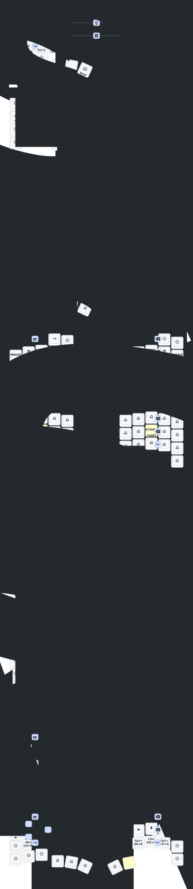

Layout features:
- ctrl + a = select all, copy
- Callum style modifiers
  - on the same layer as number for easy Win + # app switching
- variety of window management features
- number related symbols on number and symbol layers
- hold to zoom button on mouse layer
- tapdance for play/pause, fwd, rwd
- common writing punctuation on main layer
- combos for bksp, tab, enter, esc, bksp word, caps, caps word, and more
- hold esc combo for ctrl + alt + del

Work in progress!

Original note:
This keeb created by a group of people who loves keyball.

Special Thanks to:  
PCB: *[yangxing844](https://github.com/yangxing844)*  
Case: *[delock](https://github.com/delock)*  
Firmware: *[Amos698](https://github.com/Amos698)*  

